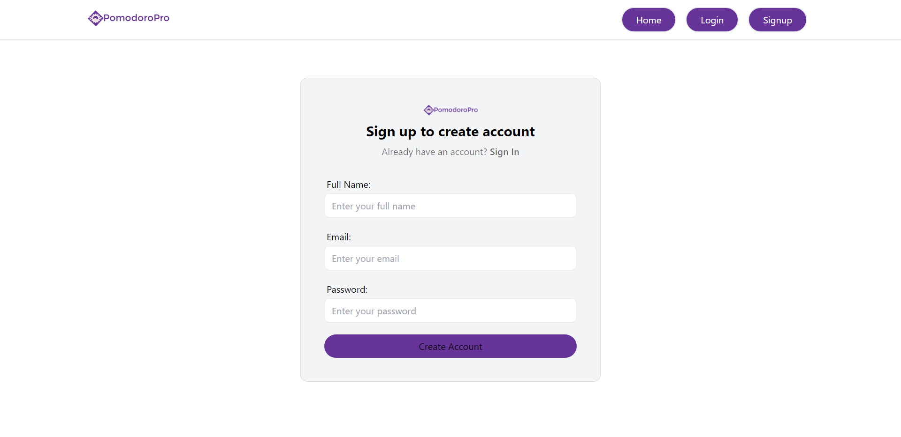
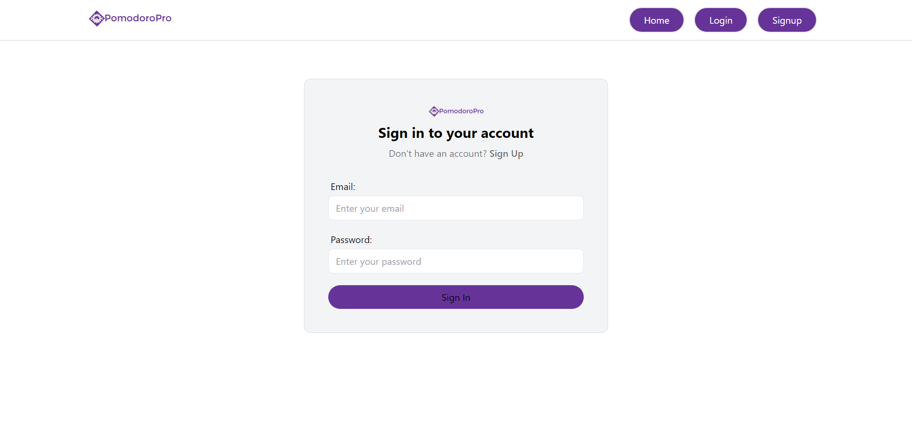
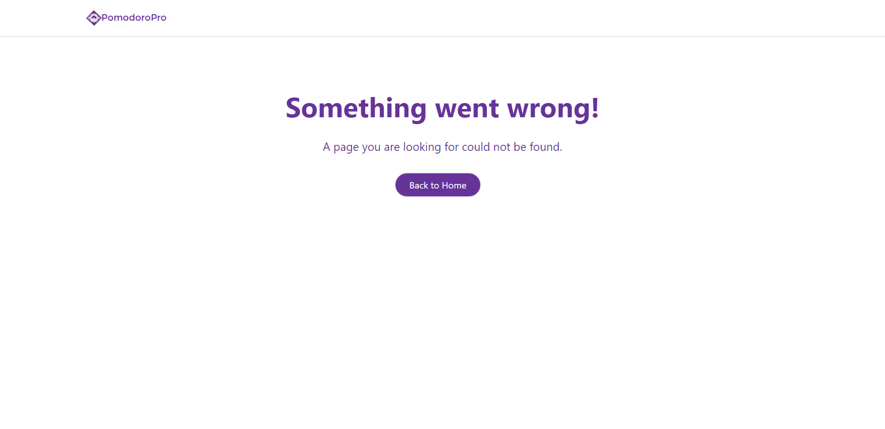

# PomoPerfect

## Description
Developed a Pomodoro timer web application with user authentication capabilities. Leveraged Appwrite for secure user registration, login, and authentication. Styled the user interface using Tailwind CSS for an elegant and responsive design. 

## Features
Timer Functionality: Users can set a timer for focused work sessions (typically 25 minutes) followed by short break intervals (5 minutes).

Pause and Reset: Users have the ability to pause or reset the timer if needed. This flexibility accommodates interruptions or adjustments to work periods.

## Tech Stack
1. Frontend: React, React Router DOM, React Redux
2. Styling: Tailwind CSS
3. Form Handling: React Hook Form
4. Backend Services: Appwrite

## Getting Started
Clone this repository to your local machine using git clone https://github.com/akashsonkamble/pomodoro-pro.git Navigate to the project directory and install dependencies using npm install Start the development server using npm run dev Open your web browser and visit http://localhost:5173 to see the app in action.
